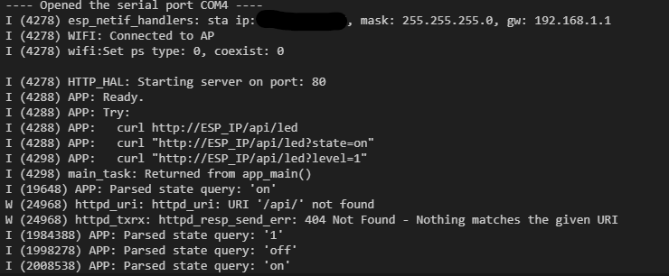
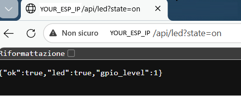

# ESP32 ESP-IDF HTTP Endpoint – Lite

📟 Embedded application (ESP-IDF) that connects an **ESP32** to Wi-Fi and exposes a minimal **HTTP API** to control a GPIO (in this application a LED).

---

## 🚀 Features
- ✅ Wi-Fi STA connection (SSID/PW configurable via `menuconfig`)
- ✅ Minimal HTTP server (ESP-IDF `httpd`)
- ✅ One endpoint to control/read a GPIO/LED: `GET /api/led`
- ✅ GPIO output pin configurable via `menuconfig` (`CONFIG_GPIO_OUT_PIN`)
- ✅ Optional DevContainer support (`.devcontainer/`) for a “ready-to-code” environment

---

## 🚀 Code Features
- ✅ Clean project structure (ESP-IDF CMake)
- ✅ Small HTTP HAL layer (`main/http_hal.*`) to keep `main.c` clean
- ✅ Wi-Fi module separated (`main/wifi.*`)
- ✅ JSON responses for easy integration with scripts/tools

---

## 🔧 Requirements
- Microcontroller: **ESP32** (tested as ESP-IDF project; should work on common ESP32 targets)
- Framework: **ESP-IDF**
- Language: **C**
- Toolchain options:
  - ESP-IDF CLI (`idf.py`)
  - VS Code + ESP-IDF extension (optional)
  - DevContainer (optional)

Hardware:
- Any ESP32 board
- (Optional) On-board LED or external LED + resistor on the configured GPIO. In this application GPIO 18 is used.
---

## 🏗️ Project Structure
```text
ESP32_IDF_HTTP_ENDPOINT/
├─ main/
│ ├─ main.c # app entry + endpoint /api/led
│ ├─ wifi.c/.h # Wi-Fi init/connect helpers
│ ├─ http_hal.c/.h # HTTP server helper/HAL (init/start/register/send JSON)
│ ├─ Kconfig.projbuild # menuconfig options (Wi-Fi + GPIO)
│ └─ common.h # logging macro (see note below)
├─ CMakeLists.txt
├─ sdkconfig # current build config (can be customized)
├─ .devcontainer/ # optional containerized environment
└─ .vscode/ # optional VS Code settings
```

## ⚙️ Quick Start (Clone → Build → Flash)

### 1) Clone
```bash
git clone https://github.com/<YOUR_ACCOUNT>/<YOUR_REPO>.git
cd ESP32_IDF_HTTP_ENDPOINT
```
### 2) Set target (first time only)
Example for ESP32 you can use bash command as follow or ESP-IDF extension:
```bash
idf.py set-target esp32
```
### 3) Configure Wi-Fi + GPIO

Open menuconfig and set:
`*WIFI CONFIG*`
`WiFi SSID → your SSID`
`WiFi Password → your password`
`WiFi Max Retry → default 5'`

`*GPIO CONFIG*`
`Output GPIO number → default 18 (change to your LED pin if needed)`

### 4) Build, Flash, Monitor
```bash
idf.py build flash monitor
```
Moreover, you can use ESP-IDF extension to build flash and monitor

## 🌐 HTTP API
Endpoint: GET /api/led

Base URL:
```c
http://<ESP_IP>/api/led
```

The endpoint supports query parameters:

state → logical state (on/off/true/false/1/0)
level → raw level (0/1)

✅ Examples

You can use curl or set http command in your browser.
Remove curl and past and copy in your browser

*Turn LED ON (logical)*
```bash
curl "http://<ESP_IP>/api/led?state=on"
```
*Turn LED OFF (logical)*
```bash
curl "http://<ESP_IP>/api/led?state=off"
```
*Set raw GPIO level*
```bash
curl "http://<ESP_IP>/api/led?level=1"
curl "http://<ESP_IP>/api/led?level=0"
```

*Response (JSON)*
```bash
{"ok":true,"led":true,"gpio_level":1}
```

Fields:

ok: request processed
led: logical LED state (true = ON)
gpio_level: the level used by the handler (0/1)

## 🗒️ Test and Results
1. Flash the application
2. Open serial monitor (idf.py monitor) where you can find your **ESP_IP**
3. Device connects to Wi-Fi (look for “Connected to AP” and an IP assignment line)
4. HTTP server starts (HTTP HAL prints the port)
5. From your PC (same network), run one of the curl commands or insert http command in bar browser

6. The configured GPIO changes state accordingly


## 🛠️ Troubleshooting
**I can’t reach the endpoint**
Ensure PC and ESP32 are on the same network
Verify the ESP32 IP address from monitor output
Try:
```bash
ping <ESP_IP>
```

Check that your router/client isolation is disabled (guest networks may block LAN devices)


**Wi-Fi won’t connect**
Re-check SSID/password in menuconfig
Ensure the network is 2.4 GHz (many ESP32 setups use 2.4 GHz)
Increase retries: WIFI_MAX_RETRY


**LED doesn’t toggle**
Verify the configured GPIO matches your board LED pin
Try an external LED + resistor on the selected GPIO
Change GPIO_OUT_PIN in menuconfig

## 🗒️ Licensing
This project includes original code from Melexis N.V. under the Apache 2.0 License. See the LICENSE file for details.
Additional functionality was added by Marconatale Parise in June 2025, including:
- Data structure to extrapolate sensor data. 
- Function to improve the code readability and for debug

Custom code for variables and constant are marked with:
```c
/* === Added by Marconatale Parise for.. [description of the new code] === */
```

Custom code for function are marked specifying the author (@author Marconatale Parise) in the description.

## 🌐 Contatti
[](mailto:marconatale.parise@gmail.com)  
[](https://www.linkedin.com/in/marconatale-parise-48a07b94)  
[](https://github.com/MpDev89)